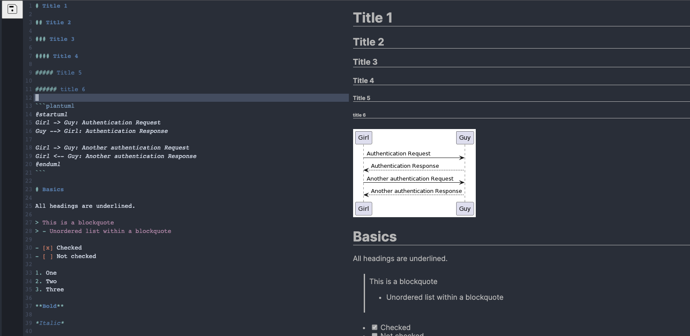

# Nordrise




A web-based CodeMirror 6 Markdown editor demo.

Code name: Nordrise.

This demo is a bit more rigid and fine-tuned compared to my previous demo [Moonrise](https://github.com/alexwkleung/Moonrise). However there are some differences between them.

1) Uses TypeScript React + Vite instead of Electron + TypeScript. Since it's web-based, you don't need to install anything to try it out.

2) It does not contain open or save functions (for now), so you'll have to implement it yourself. I've added Markdown enhancements via Remark, Rehype, and KaTeX plugins for an improved experience out of the box. 

3) The CSS is not as hack-y (and critically broken) compared to Moonrise.

4) Based off the Nord theme!

**Note:** If you're planning to add Electron into this demo, there might be some issues when combining it with Vite. So if you don't want to go through the hassle to make it work, I recommend switching to Webpack + Babel as a fallback.

**Markdown Plugins:**

- react-syntax-highlighter
- @akebifiky/remark-simple-plantuml
- rehype-katex
- rehype-slug
- remark-emoji
- remark-gfm
- remark-math
- remark-toc
- mhchem (KaTeX)

I plan on adding more features, so feel free to submit any requests.

# Development

Clone the repository

```bash
git clone <SSH/HTTPS link>
```

Change directory

```bash
cd Nordrise
```

Install npm dependencies

```bash
npm install
```

Run build step

```bash
make build
#or
npm run build
```

Run Vite

```bash
make dev
#or
npm run dev
```